# NutriScan

Application mobile Expo/React Native pour scanner des produits alimentaires, consulter leurs informations Open Food Facts, gérer des favoris, comparer des produits et suivre un historique nutritionnel personnalisé.

## Captures d'écran

### Scanner
<p>
  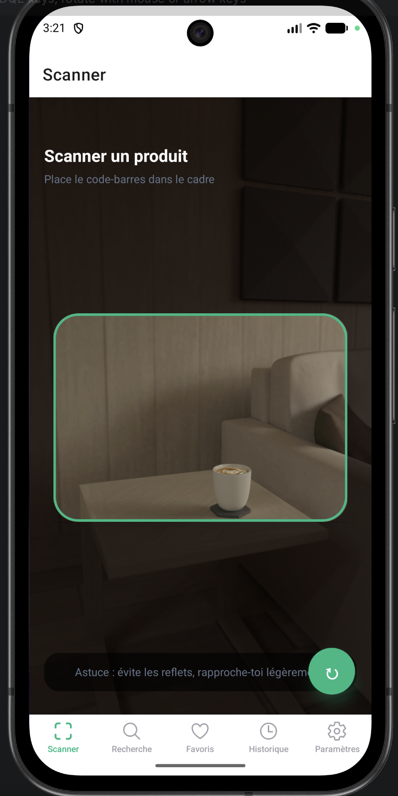
</p>

### Recherche
<p>
  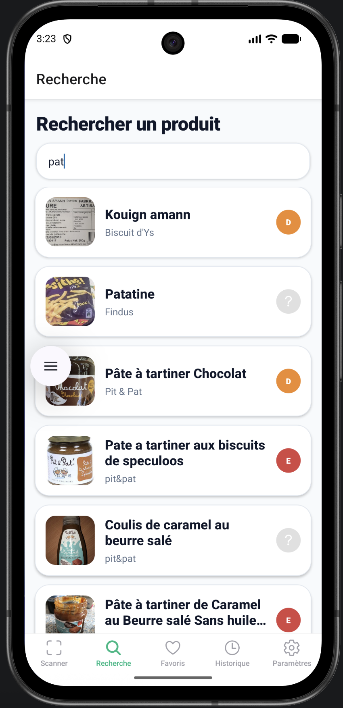
  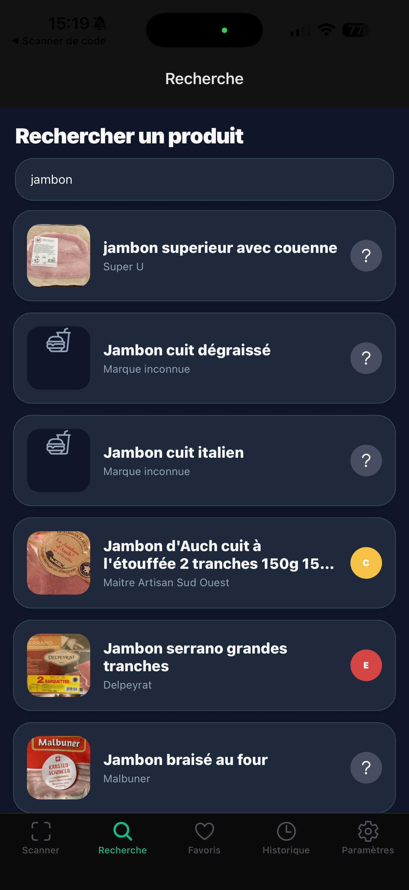

</p>

### Favoris
<p>
  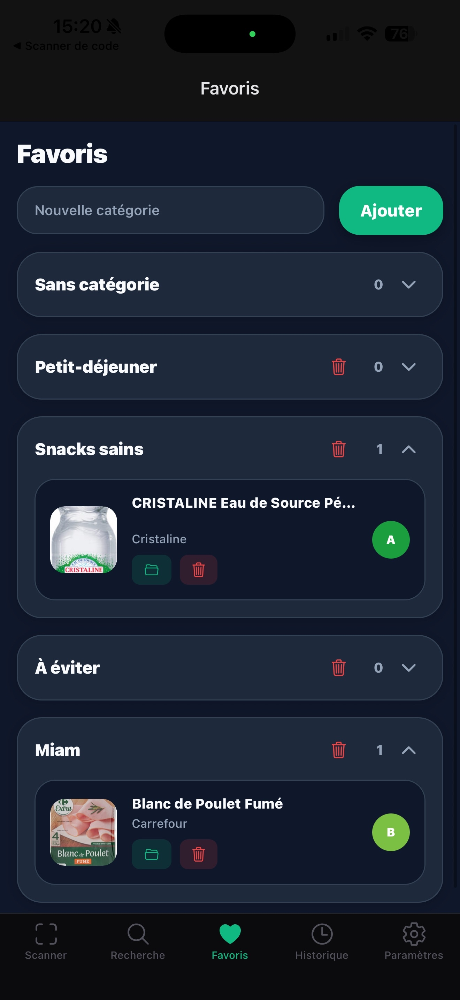
  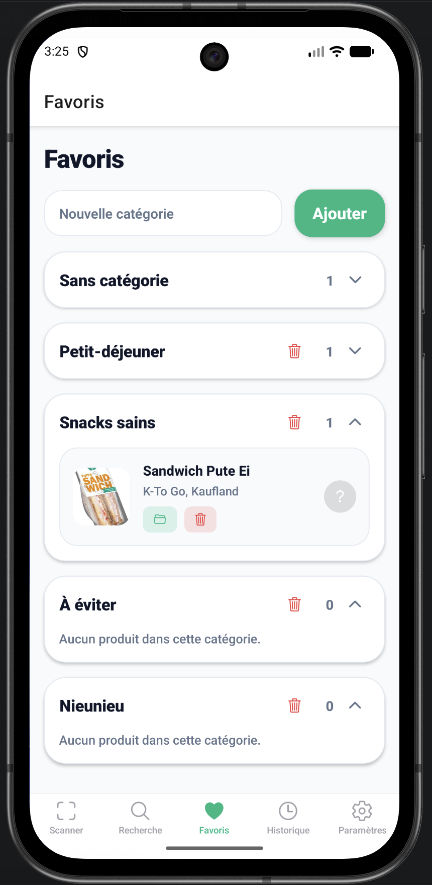
</p>

### Comparateur
<p>
  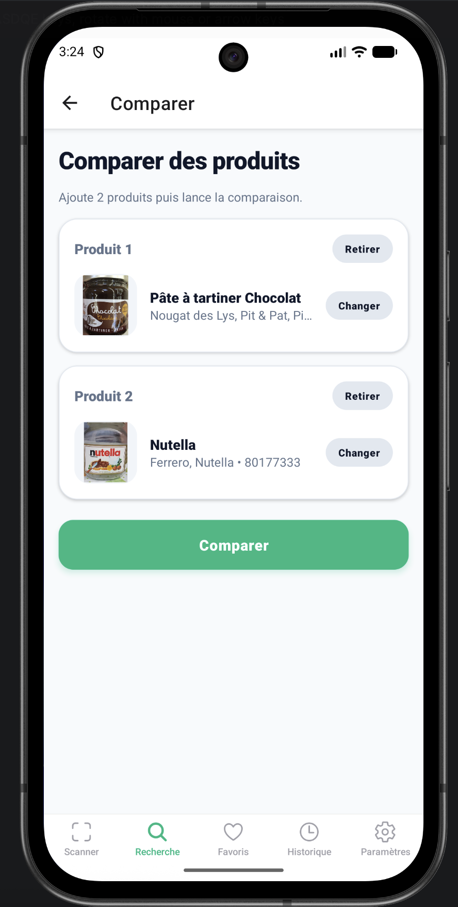
  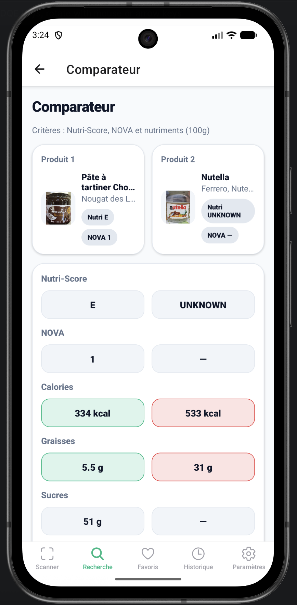
</p>

### Historique
<p>
  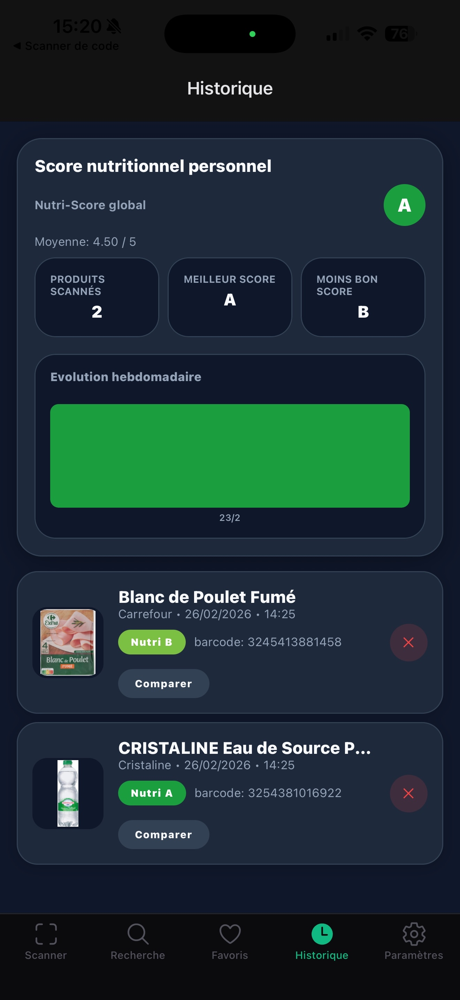
</p>

### Settings
<p>
  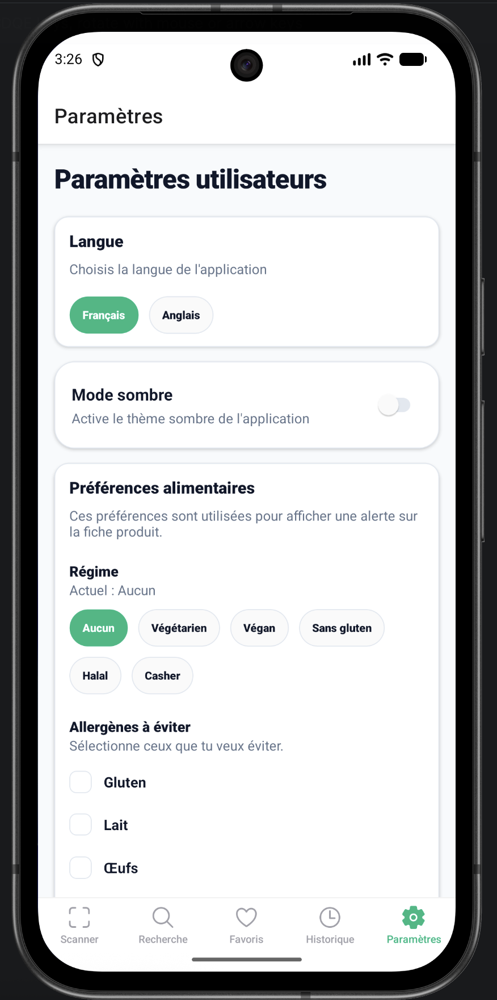
  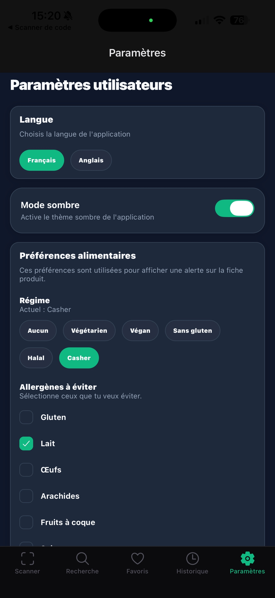
</p>

### Fiche produit
<p>
  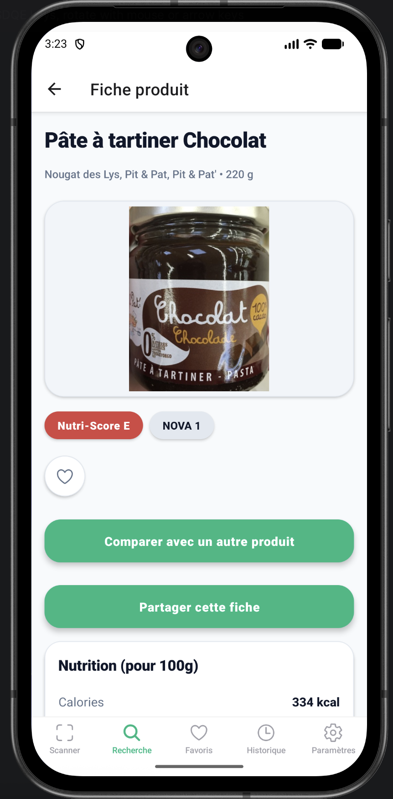
</p>

## Installation et lancement

### Prérequis
- Node.js 18+
- npm
- Expo Go (Android/iOS) ou simulateur iOS/Android

### 1. Cloner le projet
```bash
git clone https://github.com/JolanPoussier/3ANDM_Nutriscan.git
cd 3ANDM_Nutriscan
```

### 2. Installer les dépendances
```bash
npm install
```

### 3. Configurer les variables d'environnement
Créer un fichier `.env` à la racine avec :
```env
EXPO_PUBLIC_API_URL=https://world.openfoodfacts.org/api/v2/
EXPO_PUBLIC_OFF_SEARCH_BASE_URL=https://search.openfoodfacts.org
```

### 4. Lancer l'application
```bash
npm run start
```

Puis :
- `a` pour Android
- `i` pour iOS
- ou scanner le QR code avec Expo Go

## Fonctionnalités implémentées

- Scan code-barres (caméra) avec retour haptique.
- Récupération des données produit via Open Food Facts.
- Recherche produit (nom/marque/code-barres) avec debounce.
- Pagination/infinite scroll sur les résultats de recherche.
- Fiche produit complète : nutrition, ingrédients, allergènes, Nutri-Score, NOVA.
- Historique des scans (stockage local AsyncStorage).
- Suppression d'un élément de l'historique.
- Dashboard historique avec score nutritionnel personnel (global + évolution hebdomadaire).
- Comparaison de deux produits (Nutri-Score, NOVA, nutriments) avec résumé gagnant.
- Favoris avec catégories (création/suppression/déplacement).
- Mode sombre persistant.
- Préférences alimentaires : régime + allergènes à éviter.
- Alertes sur fiche produit selon préférences (allergènes/régime).
- Internationalisation FR/EN (changement de langue en paramètres).
- Partage natif de fiche produit via les apps du téléphone.

## Technologies et bibliothèques

### Stack principale
- React Native
- Expo
- TypeScript

### Navigation
- `@react-navigation/native`
- `@react-navigation/native-stack`
- `@react-navigation/bottom-tabs`

### APIs et device
- `expo-camera` (scan)
- `expo-haptics` (retour tactile)

### Stockage local
- `@react-native-async-storage/async-storage`

### UI / runtime
- `react-native-gesture-handler`
- `react-native-safe-area-context`
- `react-native-screens`

## Répartition des tâches

| Tâche | Jolan | Romain |
|---|---|---|
| Intégration API Open Food Facts (`OFFFetch`) | ✅ |  |
| Écran scanner + permissions caméra + haptics |  | ✅ |
| Écran recherche + debounce + infinite scroll | ✅ |  |
| Historique des scans + suppression |  | ✅ |
| Dashboard score nutritionnel personnel | ✅ |  |
| Comparateur de produits |  | ✅ |
| Système de favoris (base) | ✅ |  |
| Mode sombre persistant | ✅ |  |
| Préférences allergènes/régimes + règles produit |  | ✅ |
| Internationalisation (FR/EN) |  | ✅ |
| Partage natif de fiche produit |  | ✅ |
| Structuration navigation et finition UX globale | ✅ |  |
| Documentation et validation finale (README, QA) |  | ✅ |
